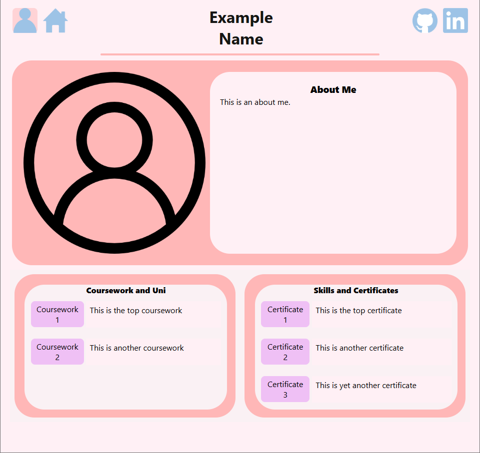
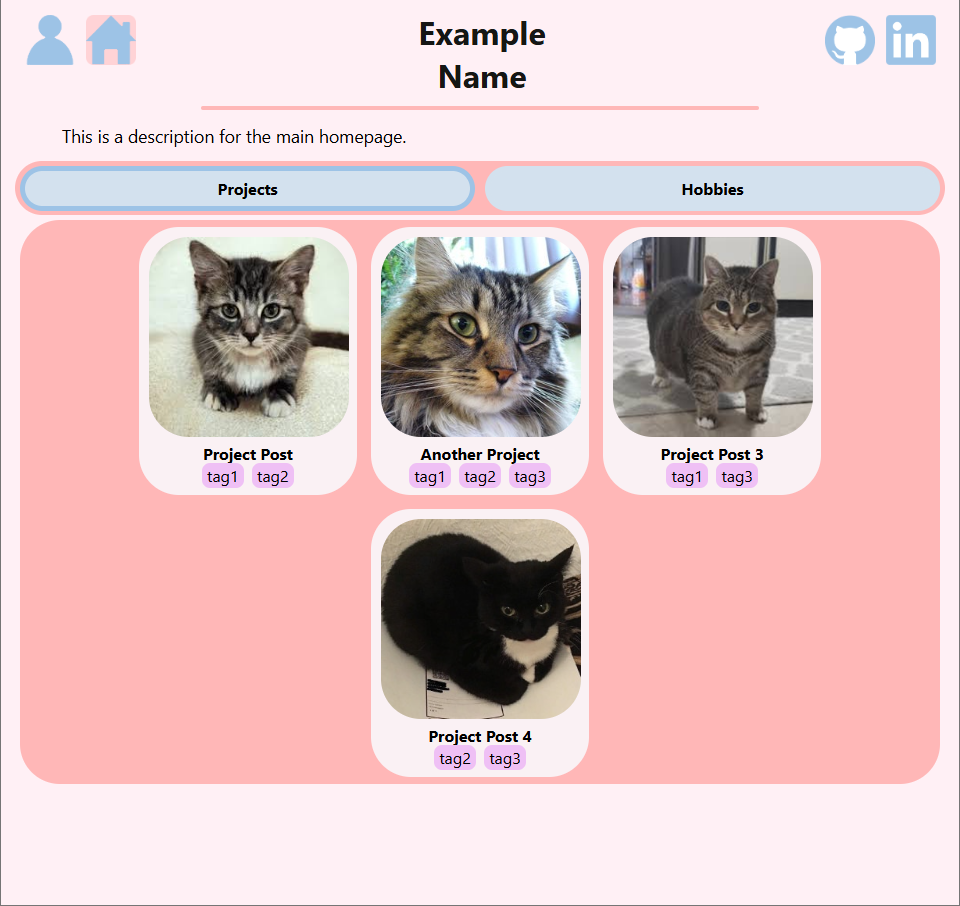
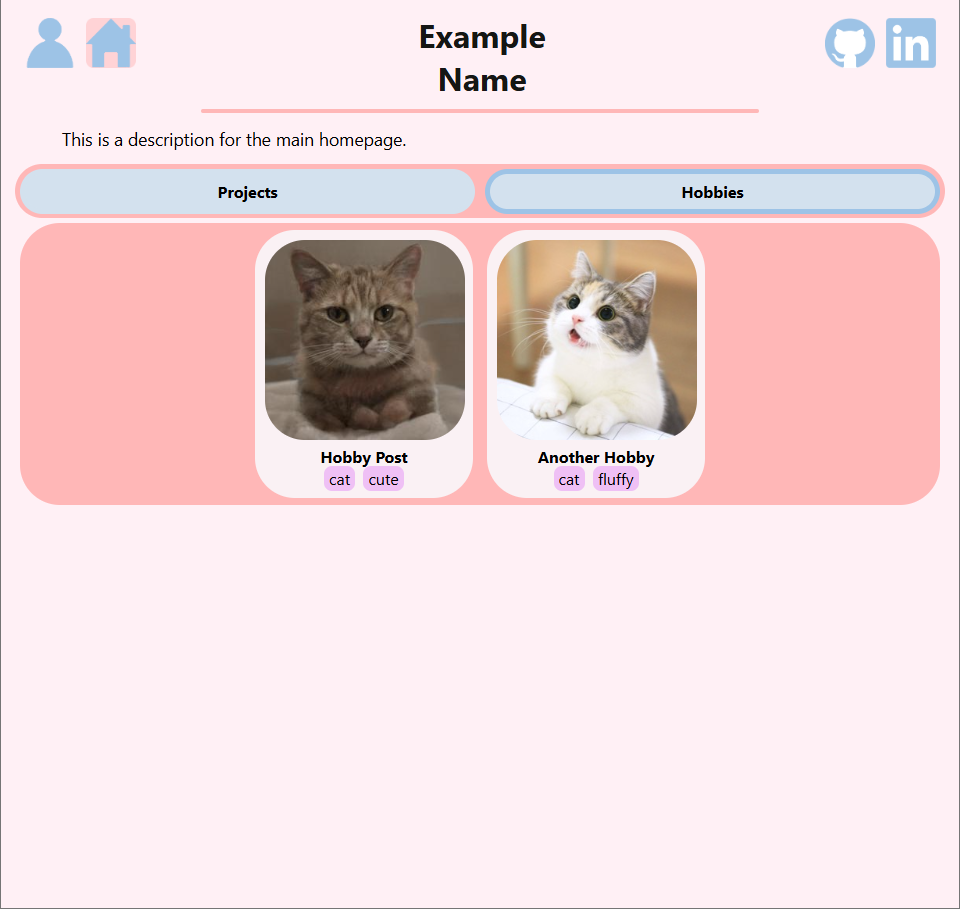

# Website Portfolio

This project uses Django to host my personal website. The structure of this website is to show off personal projects and hobbies. It comes with the docker files necessary for production as well as local deployment.

## Requirements

Install python on your computer:
https://www.python.org/downloads/

Use the python package manager [pip](https://pip.pypa.io/en/stable/) to required imports via the requirements.txt file in the source/ directory.

```bash
pip install -r requirements.txt
```

## Features
- Main page (with projects/hobbies) and Personal page (with skills/certificates)
- Posts can be either a hobby or project, containing attributes alongside an icon, a description, tags and images/videos
- Personal page contains an icon, about me and skills/certificates with their descriptions

## How to use locally
- Make migrations to create any necessary files: ``python manage.py migrate``
- Create a superuser: ``python manage.py createsuperuser``
- Run the server: ``python manage.py migrate``
- Log into the admin panel: ``http://127.0.0.1:8000/admin``
- There are 2 main editable sections:
    - Me: modify the name for the site and the personal information and links
    - Post: create posts with icons, images, videos, descriptions, tags and attributes

## File Layout
```
📦project
 ┣ 📂nginx                   <- holds config files for nginx
 ┣ 📂src                     <- holds html, css, icons and python files for the website
 ┣ 📂screenshots             <- screenshots for the readme file
 ┣ 📜manage.py               <- for cli commands
 ┣ 📜requirements.txt        <- holds dependencies for the code
 ┣ 📜Dockerfile              <- used to build a docker image
 ┣ 📜docker-compose.yml      <- used for local-specific development settings
 ┣ 📜docker-compose.prod.yml <- used for prod-specific development settings
 ┣ 📜entrypoint.sh           <- script for the docker image on startup
 ┣ 🧾.env.local              <- environment variables for local development
 ┣ 🧾.env.prod               <- environment variables for prod development
 ┣ 🧾.gitignore              <- files ignored by git
 ┗ 📙README.md               <- this current file
```

## Screenshots


